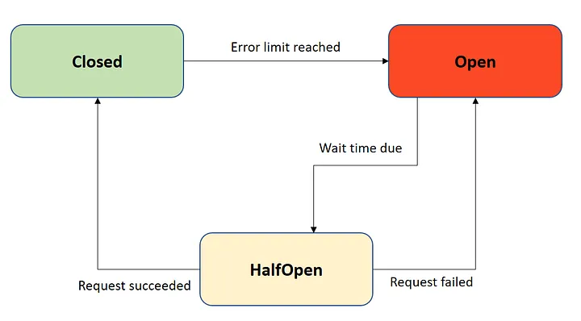

<h1 align="center">Circuit Breaker</h1>
<h5 align="center">Circuit breaker for microservice intercommunication</h5>

## Overview

Circuit breaker refers to a design pattern that is used to enhance the stability and resilience of a system composed of multiple microservices.

In a microservice architecture, various services communicate with each other over the network. If one service is experiencing issues, such as high latency, unavailability, or errors, it can potentially affect the overall performance and reliability of the entire system. The circuit breaker pattern aims to mitigate these issues by providing a mechanism to detect and handle failures in a more controlled manner.

Circuit breaker pattern works on three states.

1. Closed State: Circuit breaker allows normal communication between services. It monitors the responses from a specific service. If the responses are within acceptable limits, the circuit remains closed, and requests are allowed to flow through.
2. Open State: If circuit breaker detects a predefined threshold of failures such as consecutive failed requests or high latency, it transitions into the open state. In this state, the circuit breaker prevents requests from being sent to the troubled service, effectively breaking the circuit to that service.
3. Half-Open State: After a predefined period of time or under certain conditions, the circuit breaker transitions into a half-open state. During this state, a limited number of test requests may be allowed to pass through to the troubled service. If these test requests are successful, the circuit breaker transitions back to the closed state, assuming the service has recovered. If the test requests still fail, the circuit breaker remains in the open state.

 
[image-source](https://medium.com/javarevisited/what-is-circuit-breaker-in-microservices-a94f95f5e5ae)

 

## Implementation

This microservice is implemented using Java with [Spring](https://spring.io/) framework and uses [Resilience4j](https://resilience4j.readme.io/docs) to implement the circuit breaker pattern.

This microservice calls external services; namely user-service and cryptocurrency-service and they are configured with circuit breakers.
